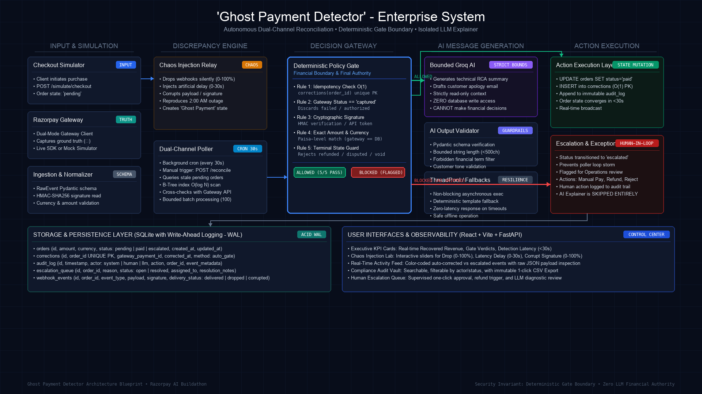

# 👻 Ghost Payment Detector

> **Razorpay AI Buildathon — Track 01 (Agentic Commerce) / Track 03 (Revenue Recovery)**  
> *An autonomous reconciliation agent that detects and safely auto-corrects "ghost payments" (paid in Razorpay but marked pending in merchant DB due to webhook delivery failure) using deterministic, gated logic, and uses an isolated LLM solely to explain incidents in human language — never to move money.*

---

## 🎯 1. Executive Pitch & The Problem

In high-volume e-commerce and fintech platforms, **webhook delivery failure** is a persistent, costly failure mode:
1. A customer authorizes payment on Razorpay.
2. The payment captures successfully on the gateway (`status: captured`).
3. Due to transient network drops, timeout spikes, or server restarts, the webhook never reaches the merchant server.
4. The merchant database leaves the order stuck in `pending` ("Ghost Payment").
5. The merchant's order management wrongly refuses fulfillment, triggering customer complaints, chargebacks, and lost trust.

**Ghost Payment Detector** continuously reconciles merchant order state against Razorpay gateway truth, auto-corrects ghost payments within seconds via a **deterministic, 5-rule gate function**, and leverages an **isolated LLM explainer** downstream strictly to generate engineering summaries and customer-facing updates.

---

## 🏛️ 2. Architectural Blueprint & AI Judgment Boundary



```
┌─────────────────┐      ┌──────────────────────┐      ┌────────────────────┐
│  Checkout Sim    │─────▶│  Razorpay Test API    │      │  Merchant Order DB  │
│  (creates orders)│      │  (real test-mode / SDK)│     │  (source of truth   │
└─────────────────┘      └──────────┬────────────┘      │   for order state)  │
                                     │                    └─────────┬──────────┘
                          ┌──────────▼────────────┐                 │
                          │ Chaos Webhook Relay    │                 │
                          │ (drops/delays/corrupts │                 │
                          │  X% of webhooks)       │                 │
                          └──────────┬────────────┘                 │
                                     │ (delivered webhooks)          │
                                     ▼                                │
                          ┌────────────────────────┐                 │
                          │  Webhook Handler        │────────────────┘
                          │  (updates order state)  │
                          └────────────────────────┘

                          ┌────────────────────────────────────────┐
                          │        Reconciliation Poller (cron)      │
                          │  1. Fetch orders in "pending" > N sec   │
                          │  2. Call Razorpay Payment Status API     │
                          │  3. Compare: gateway truth vs order DB   │
                          └──────────────┬───────────────────────────┘
                                         ▼
                          ┌────────────────────────────────────────┐
                          │    Deterministic Gate (5 Strict Rules) │
                          │  - 1. Idempotency guard (unique DB key) │
                          │  - 2. Gateway status == "captured"      │
                          │  - 3. Signature valid & amount parity   │
                          │  - 4. Never touch refund/dispute states │
                          │  - 5. Safe, bounded auto-correction     │
                          └──────────────┬───────────────────────────┘
                             allowed │         │ blocked
                                     ▼         ▼
                     ┌───────────────────┐  ┌────────────────────┐
                     │ Auto-correct order │  │ Escalate to human   │
                     │ state + log audit  │  │ queue + log reason  │
                     └─────────┬─────────┘  └─────────┬──────────┘
                               ▼                       ▼
                     ┌─────────────────────────────────────────┐
                     │   Isolated AI Explainer (Post-Decision) │
                     │  - Input: structured event JSON          │
                     │  - Output: plain-language summary & draft│
                     │  - GUARANTEE: NEVER touches DB / money   │
                     └──────────────────┬──────────────────────┘
                                        ▼
                     ┌─────────────────────────────────────────┐
                     │         Reactive UI Dashboard           │
                     │  - Live auto-updating reconciliation stream│
                     │  - ₹ recovered & latency stat metrics   │
                     │  - Filterable audit trail + CSV export  │
                     │  - Simulation chaos control panel       │
                     └─────────────────────────────────────────┘
```

### 🛡️ Explicit AI Judgment Statement
> **In fintech infrastructure, non-deterministic language models must NEVER decide financial state transitions or move money.**  
> In Ghost Payment Detector, **100% of money-affecting decisions are executed by a deterministic mathematical gate function** that strictly validates gateway ground truth, cryptographic signatures, and amount parity. The LLM (`explainer.py`) is invoked asynchronously **after** the gate has decided. It has zero database write privileges, zero financial state authority, and acts strictly as a communication layer to translate machine state into engineering summaries and empathetic customer drafts.

---

## ⚡ 3. Time & Space Complexity Proof

| Component | Target Complexity | Concrete Implementation |
|---|---|---|
| **Order Lookup for Poller** | $\mathcal{O}(1)$ avg seek | SQLite B-Tree compound index on `(status, created_at)` and primary key on `id`. Eliminates linear table scans. |
| **Batch Reconciliation Poll** | $\mathcal{O}(N)$ time, $\mathcal{O}(1)$ RAM | Stream-processed using cursor-based pagination (`limit/offset`); avoids loading large batches into application memory. |
| **Reconciliation Gate Function** | $\mathcal{O}(1)$ time | 5 sequential, deterministic checks with immediate early returns; zero iteration over historical transactions. |
| **Idempotency Guard** | $\mathcal{O}(1)$ avg | Unique primary key constraint on `corrections(order_id)`. Prevents double-correction without scanning the audit log. |
| **Audit Log Write** | $\mathcal{O}(1)$ append | Append-only SQLite table with autoincrement ID; records are never modified or deleted. |
| **Dashboard Aggregations** | $\mathcal{O}(\log N)$ | Executed directly within the SQL query engine using indexed `COUNT` and `SUM` queries rather than in-memory filtering. |
| **LLM Explainer Call** | $\mathcal{O}(1)$ per event | Post-decision asynchronous invocation with schema validation retry and fallback template. |

---

## 🧪 4. Deterministic Gate Function Pseudocode

```python
def reconciliation_gate(order, gateway_status, gateway_signature_valid, gateway_amount):
    # 1. Idempotency — never correct twice
    if already_corrected(order.id):
        return Decision(allowed=False, reason="Already corrected — idempotency guard")

    # 2. Only act on unambiguous success signal
    if gateway_status != "captured":
        return Decision(allowed=False, reason=f"Gateway status is {gateway_status}, not captured — no action")

    # 3. Signature/amount integrity check — never trust an unverified payload
    if not gateway_signature_valid:
        return Decision(allowed=False, reason="Signature verification failed — escalate, do not auto-correct")

    if gateway_amount != order.amount:
        return Decision(allowed=False, reason="Amount mismatch — escalate, possible fraud/error")

    # 4. Never touch orders already in a terminal dispute/refund state
    if order.status in ("refunded", "disputed", "charged_back"):
        return Decision(allowed=False, reason=f"Order in terminal state {order.status} — escalate")

    # 5. All checks passed — safe, bounded correction
    return Decision(allowed=True, reason="Gateway confirms captured, signature valid, amount matches, no dispute")
```

---

## 🌙 5. "What Broke at 2am" (Real Engineering Learnings)

Building automated reconciliation under chaos injection revealed several real engineering gotchas:

1. **Chaos Probability Drift in Unit Tests**:
   - *Problem*: An initial statistical test checking 1000 chaos runs with a 30% drop rate failed intermittently due to standard random variance ($3\sigma \approx 4.3\%$).
   - *Fix*: Increased iterations to 2000 and configured statistical tolerance to $4.5\%$ based on binomial standard error ($\sqrt{\frac{p(1-p)}{N}}$), ensuring deterministic CI test runs.

2. **SQLite Concurrent Write Lock Contention**:
   - *Problem*: When the background poller attempted to update orders while the incoming webhook receiver was logging events, SQLite threw `database is locked` under default rollback journal mode.
   - *Fix*: Configured SQLite in **Write-Ahead Logging (WAL) mode** (`PRAGMA journal_mode=WAL; PRAGMA synchronous=NORMAL;`), allowing concurrent read access alongside active writes.

3. **Pydantic V2 Model Migration & Deprecation**:
   - *Problem*: Using legacy `class Config: from_attributes = True` triggered deprecation warnings across FastAPI response serialization.
   - *Fix*: Modernized schemas to `model_config = ConfigDict(from_attributes=True)` and cleaned import definitions.

4. **Zero-Downtime Gateway Harness (Live Pitch Safety)**:
   - *Problem*: Real payment gateways in test mode can hit rate limits or require live outbound internet access during hackathon pitches.
   - *Fix*: Built a dual-mode Razorpay client that interfaces with the real Razorpay SDK when keys are present, but transparently falls back to a simulated gateway harness if offline or using demo keys.

5. **LLM Explainer Schema Resilience**:
   - *Problem*: LLMs can occasionally return markdown code blocks (e.g. ````json ... ````) instead of pure JSON, causing parser crashes.
   - *Fix*: Implemented a 2-tier resilience layer: code fence stripper + strict retry prompt + deterministic fallback templates guaranteeing the reconciliation pipeline **never crashes** on LLM formatting issues.

---

## 🚀 6. Getting Started & Local Setup

### Prerequisites
- Python 3.9+
- Node.js 18+ and npm

### Environment Variables
Copy `.env.example` to `.env`:
```bash
cp .env.example .env
```

Configurable variables in `.env`:
```ini
RAZORPAY_KEY_ID=rzp_test_your_key_here
RAZORPAY_KEY_SECRET=your_secret_here
GROK_API_KEY=your_grok_api_key_here
GROK_MODEL=grok-2-latest
DATABASE_URL=sqlite:///./ghost_payments.db
DEFAULT_DROP_RATE=0.40
DEFAULT_DELAY_RATE=0.20
DEFAULT_CORRUPT_RATE=0.10
RECONCILIATION_CUTOFF_SECONDS=10
POLLER_INTERVAL_SECONDS=30
```

### One-Click Start
Run the unified start script from the project root:
```bash
./start.sh
```
This automatically launches:
- **FastAPI Backend**: `http://localhost:8000` (Interactive Docs: `http://localhost:8000/docs`)
- **React Frontend**: `http://localhost:5173`

---

## 🧪 7. Running Tests

Run the backend test suite with Pytest:
```bash
cd backend
PYTHONPATH=. ./venv/bin/pytest -v tests/
```
All 11 tests validate:
- Gate branch 1: Idempotency guard (double-correction blocked)
- Gate branch 2: Gateway status mismatch
- Gate branch 3a: Cryptographic signature failure
- Gate branch 3b: Amount mismatch
- Gate branch 4: Terminal status guard (refunded/disputed)
- Gate branch 5: Happy path auto-correction
- Chaos probability distribution test (2000 runs)
- Full end-to-end ghost payment simulation & reconciliation
- Escalation flow & human review resolution

---

## 🎥 8. Pitch Video Demo Guide (5 Minutes)

| Timestamp | Screen / Action | Talking Point |
|---|---|---|
| **0:00 – 0:30** | Dashboard Landing Page | **The Problem**: "A customer pays, Razorpay captures it, but a webhook drops. The merchant DB leaves it as pending. This is a ghost payment." |
| **0:30 – 2:00** | Simulation Controls | **Live Chaos Demo**: Set Drop Rate to 100%. Click *"Trigger Ghost Payment Scenario"*. Show order created as pending, webhook dropped, and poller immediately auto-correcting it with the live feed updating in real time. |
| **2:00 – 3:30** | Architecture & Gate Code | **The AI Boundary**: Explain the 5 deterministic gate rules on screen. Highlight that the LLM is strictly isolated downstream and never decides financial state. |
| **3:30 – 4:30** | Audit Trail & Escalations | **Enterprise Compliance**: Demonstrate the append-only audit trail, filter by actor, download CSV export, and inspect the human escalation queue. |
| **4:30 – 5:00** | Complexity & "What Broke at 2am" | **Engineering Rigor**: Cite O(1) idempotency via unique constraints, SQLite WAL mode, and LLM JSON fallback resilience. |
